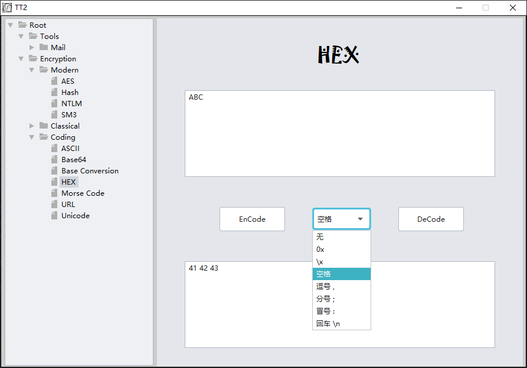

# Java Tools For CTF

目前为测试中版本，使用中任何问题都可以在github上联系我。

## 界面视图

## 工具清单
 
- Disposable Email Check(Test)
---
- AES(Test)
- Hash
  - MD5
  - MD5-16
  - MD2
  - MD4
  - SHA-1
  - SHA-224
  - SHA-256
  - SHA-384
  - SHA-512
 - SM3
---
- Atabash 
- ROT13
- Rail Fence
---
- ASCII
- Base64
- Base Conversion
- HEX
- Morse Code
- URL
- Unicode
---

增加中...
---
- Vigenere
- DES,3DES
