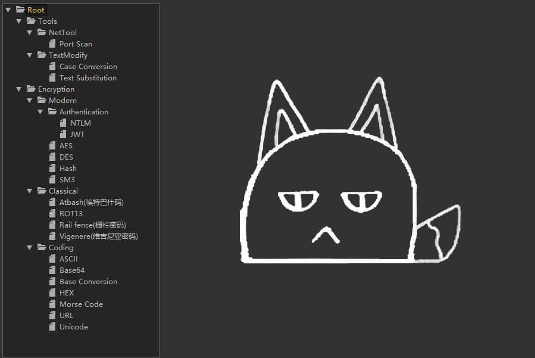
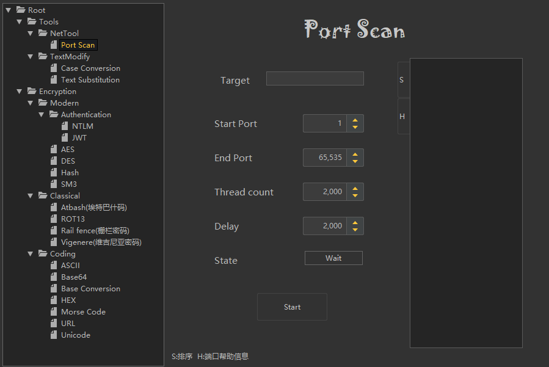
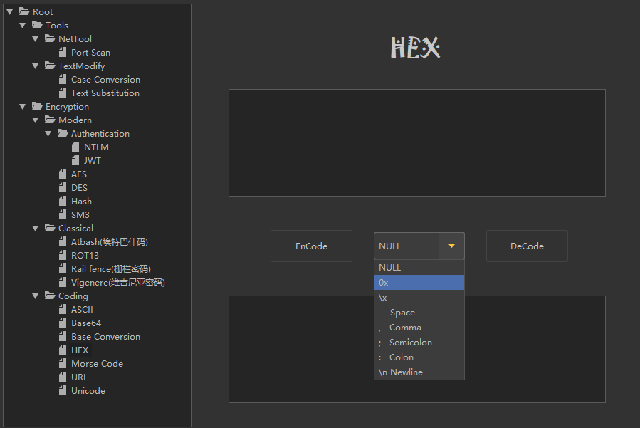
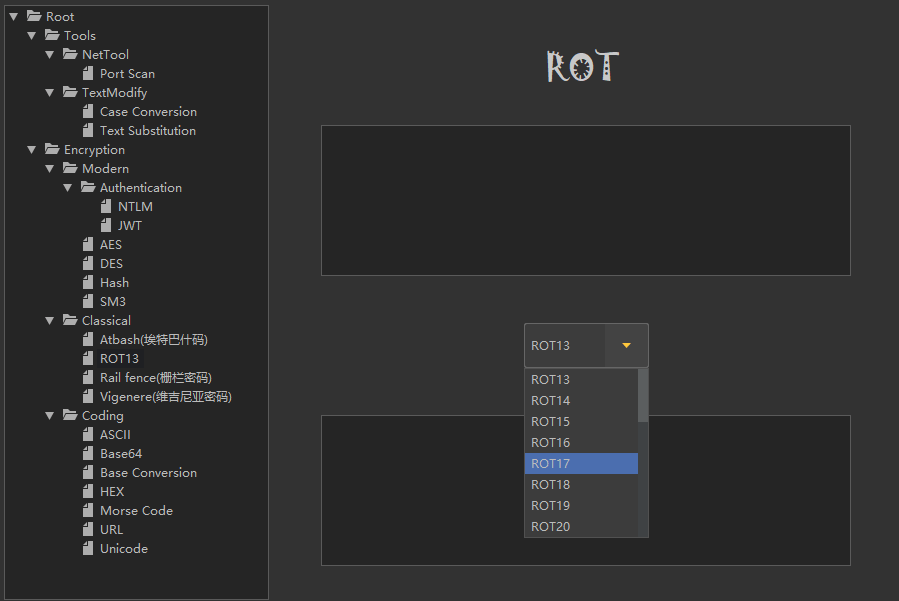

# CryptionTool

**简介:** 一个CTF+渗透测试工具框架，主要实现功能在加解密和编码这块，在软件使用过程中发现问题或建议欢迎提交 issue.

请使用JDK版本8及以上的JDK运行本软件

本软件使用Java 8编写，双击即可启用

不定期更新

---

# 目前支持的功能

**工具**
- 网络工具
  - Port Scan(端口扫描)
  - WebDirectory Scan(WDB目录扫描)
- 文本处理
  - Case Convert(大小写转换)
  - Text Replace(文字替换)
  - Text Separate(文本分隔)

**加解密/编解码**
- 现代
  - 认证
    - NTLM-HASH
    - JWT
  - AES(Test)
  - Hash
    - MD5
    - MD5-16
    - MD2
    - MD4
    - SHA-1
    - SHA-224
    - SHA-256
    - SHA-384
    - SHA-512
  - SM3
  - SM4
- 古典
  - Atabash(埃特巴什码)
  - ROT13
  - Rail Fence(栅栏密码)
  - Vigenere(维吉尼亚密码)
- 编码
  - ASCII
  - Base64
  - Base Conversion
  - Base Conversion 2(以分割符为界一次转换多个)
  - HEX
  - Morse Code
  - URL
  - Unicode

**待实现...**
- DES,3DES
- SM2
- LM
- 更多的文本处理

---

# 界面展示

---

# 免责声明

本人编写的工具,仅供学习和研究使用,请勿使用文中的技术源码用于非法用途,任何人造成的任何负面影响,与本人无关.
