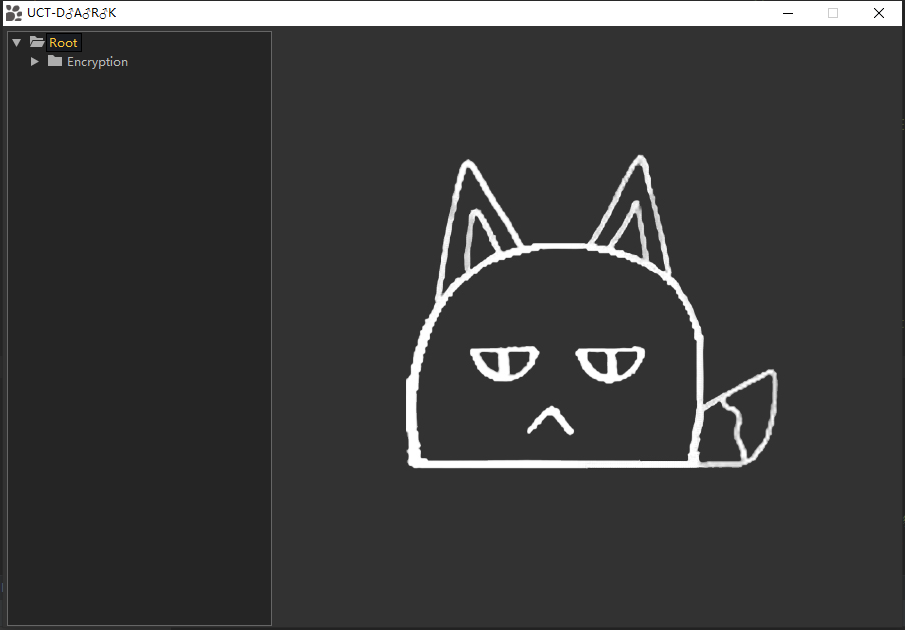
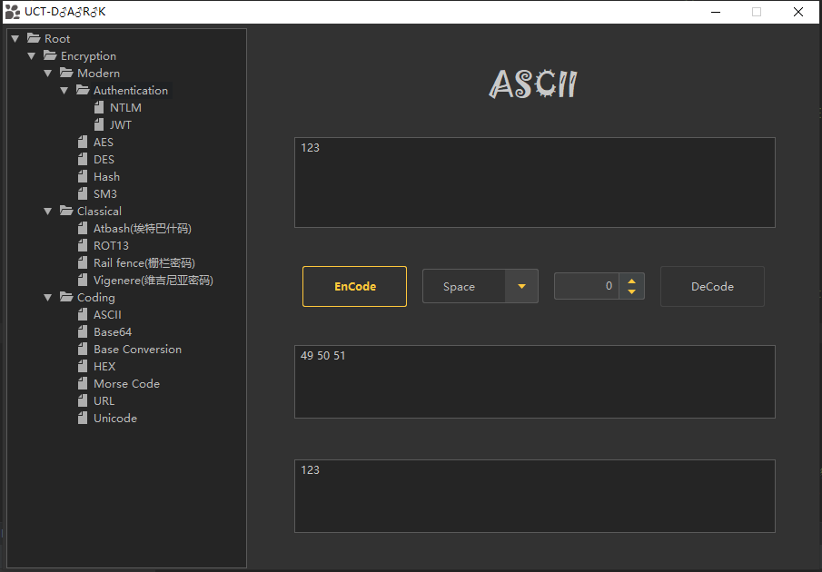

# Java Tools For CTF

目前为测试中版本，使用中任何问题都可以在github上提出。

## 界面视图

## 工具清单
 
- Case conversion
- Text substitution
---
- JWT
- NTLM-HASH
- AES(Test)
- Hash
  - MD5
  - MD5-16
  - MD2
  - MD4
  - SHA-1
  - SHA-224
  - SHA-256
  - SHA-384
  - SHA-512
 - SM3
---
- Atabash 
- ROT13
- Rail Fence
- Vigenere
---
- ASCII
- Base64
- Base Conversion
- HEX
- Morse Code
- URL
- Unicode
---

增加中...
---
- DES,3DES
- SM2,SM4
- LM
- 更多的文本处理

# 声明
本人编写的工具,仅供学习和研究使用,请勿使用文中的技术源码用于非法用途,任何人造成的任何负面影响,与本人无关.